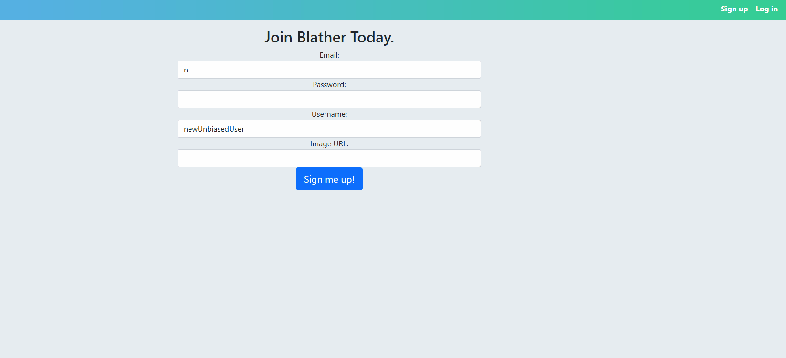
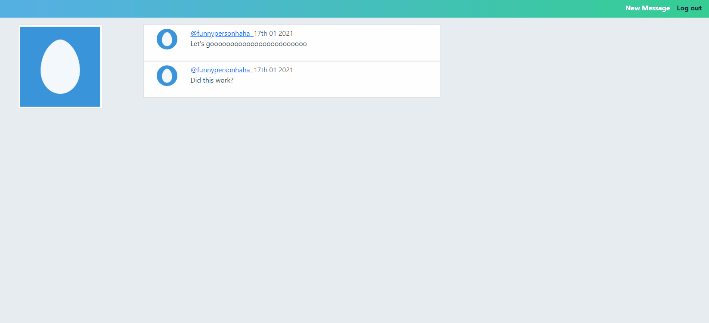

# Blather

Libraries/Frameworks used: React, Express.js, Redux, Axios, Mongoose, CORS, JSONWebToken, bcrypt

Techonologies used: Node.js, MongoDB

Blather is a social media app that allows you to share your thoughts with other users on the platform. It takes advantage of authorization and authentication using tokens and one-way password encryption in order to properly ensure the safety of the users.

# Creating a Message

